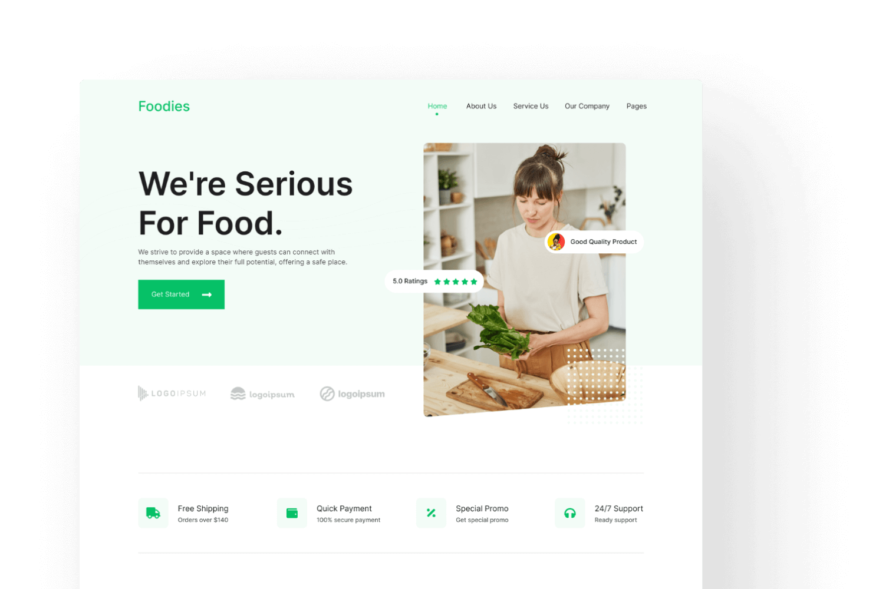

# 🍽️ Foodies — Responsive Landing Page



A clean, responsive **HTML / CSS / JavaScript** landing page for a food-themed brand called **Foodies**.
Built with semantic HTML5, modern CSS (flexbox + grid), and lightweight vanilla JS for interactivity.

---

## 🏷️ Badges


---

## 🌐 Live Demo

🔗 **[View Live Demo](https://ic-assignment-02.netlify.app)**

---

## 📋 Table of Contents

-   [🍽️ Foodies — Responsive Landing Page](#️-foodies--responsive-landing-page)
    -   [🏷️ Badges](#️-badges)
    -   [🌐 Live Demo](#-live-demo)
    -   [📋 Table of Contents](#-table-of-contents)
    -   [📖 Overview](#-overview)
    -   [✨ Features](#-features)
    -   [📁 File Structure](#-file-structure)
    -   [⚙️ Getting Started](#️-getting-started)
    -   [📦 Dependencies \& Assets](#-dependencies--assets)
    -   [🧠 How It Works](#-how-it-works)
        -   [**HTML**](#html)
        -   [**CSS**](#css)
        -   [**JavaScript (app.js)**](#javascript-appjs)
        -   [**Accessibility \& SEO**](#accessibility--seo)
    -   [📱 Responsive Design](#-responsive-design)
    -   [🎨 Customization](#-customization)
    -   [🚀 Performance Tips](#-performance-tips)
    -   [🧾 License \& Credits](#-license--credits)
    -   [💬 Contributing](#-contributing)
    -   [💖 Author](#-author)
        -   [🏁 Final Note](#-final-note)

---

## 📖 Overview

**Foodies** is a fully responsive landing page template designed for restaurants, cafes, and food startups.
It uses modern layout techniques, a minimalist design, and smooth navigation interactions — ideal for personal or commercial use.

---

## ✨ Features

-   📱 **Fully responsive** (mobile-first) layout
-   🍔 **Hamburger navigation menu** with smooth toggle
-   🎨 **Custom CSS variables** for easy theming
-   ⚡ Lightweight, no dependencies — pure HTML, CSS, JS
-   🧩 Reusable section components (Hero, Features, Products, CTA, Footer)
-   🧠 Accessible and semantic structure
-   🧾 Active link highlighting
-   📧 Email subscription section (static form placeholder)

---

## 📁 File Structure

```

foodies-landing/
├── index.html
├── assets/
│ ├── css/
│ │ └── styles.css
│ ├── js/
│ │ └── app.js
│ └── images/
│ ├── hero-image.png
│ ├── brand-1.png
│ ├── ...
│ └── preview.jpg
└── README.md

```

---

## ⚙️ Getting Started

1. **Clone or download** this repository:

    ```bash
    git clone https://github.com/yourusername/foodies-landing.git
    ```

2. **Open** `index.html` directly in your browser, or start a local server:

    Visit: [http://localhost:3000](http://localhost:3000)

That’s it! No build tools or dependencies required.

---

## 📦 Dependencies & Assets

-   **Google Fonts:** [Inter](https://fonts.google.com/specimen/Inter)
-   **Font Awesome:** for icons
-   **Images:** stored in `assets/images/`
-   **No frameworks** — everything built from scratch.

---

## 🧠 How It Works

### **HTML**

-   Semantic layout using `<header>`, `<main>`, `<section>`, and `<footer>`.
-   `.nav-toggle` button for mobile menu; `.main-nav` contains links.

### **CSS**

-   Custom properties (`--primary-color`, etc.) for easy color management.
-   Flexbox and Grid used for layout consistency.
-   Responsive typography with `clamp()` and spacing utilities.
-   Smooth hover transitions on links and buttons.

### **JavaScript (app.js)**

-   Handles the mobile navigation toggle:

-   Updates .active state on nav links.

-   Closes the menu when a link is clicked.

-   Manages aria-expanded for accessibility.

### **Accessibility & SEO**

-   Semantic HTML tags
-   ARIA attributes (aria-label, aria-expanded)
-   Responsive images (max-width: 100%)
-   Descriptive alt text for images
-   Fast load, clean structure

## 📱 Responsive Design

| Device           | Layout                         |
| :--------------- | :----------------------------- |
| Mobile (<768px)  | Stacked content, hamburger nav |
| Tablet (≥768px)  | Two-column hero, nav visible   |
| Desktop (≥992px) | Full grid layout, wide hero    |

---

## 🎨 Customization

You can easily tweak:

-   **Colors:** in `:root` of `styles.css`
-   **Fonts:** replace Google Font import
-   **Buttons:** modify `.btn` styles
-   **Hero section:** replace `hero-image.png`
-   **Icons:** use different Font Awesome icons

## 🚀 Performance Tips

-   Use optimized `.webp` images
-   Minify CSS & JS before deployment
-   Cache assets for faster reloads
-   Use CDN for Font Awesome
-   Add `<link rel="preconnect">` for Google Fonts

---

## 🧾 License & Credits

**License:** [MIT License](LICENSE)

```
MIT License
© 2025 DevZiaus
```

**Credits:**

-   [Font Awesome](https://fontawesome.com) — Icons
-   [Google Fonts](https://fonts.google.com) — Inter font

## 💬 Contributing

Pull requests and suggestions are welcome!
If you’d like to contribute, open an issue or fork this repo.

---

## 💖 Author

**Md Ziaus Samad**
📧 [dev.ziaus@gmail.com](dev.ziaus@gmail.com)
🌐 [https:devziaus.github.io](https:devziaus.github.io)

---

### 🏁 Final Note

This project is a perfect starting point for anyone learning **frontend development** or **responsive design**.
It’s minimal, fast, and easy to customize — ideal for portfolios or small business websites.
